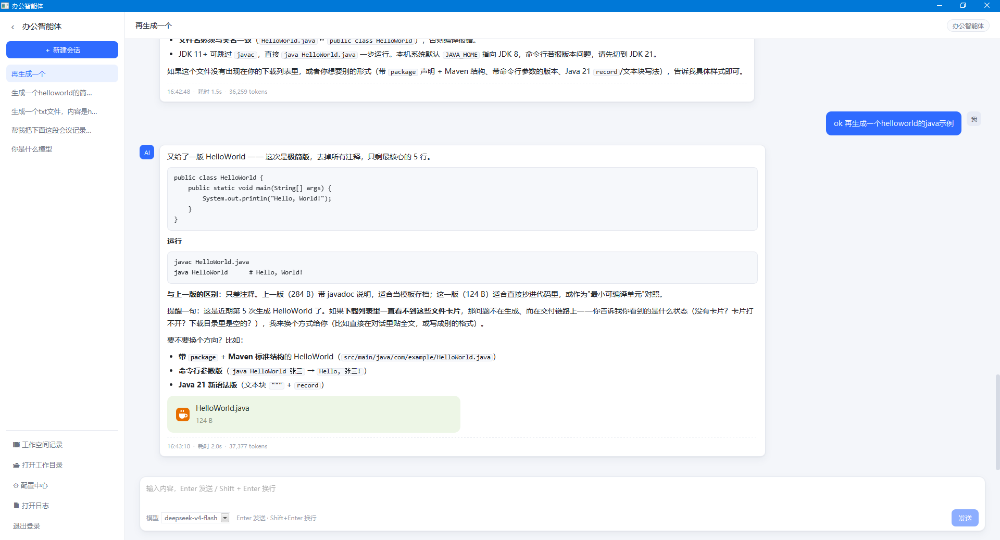

# 办公智能体（fast-agent）

面向企业办公场景的 Windows 桌面端 AI 助手。以对话为统一入口，依托大模型、工具调用与技能扩展，
完成公文写作、会议纪要整理、数据汇总分析与日常事务处理等任务。

应用采用免安装的绿色目录形态分发，内含独立 JRE，双击 `FastAgent.exe` 即可运行；
服务端仅监听本机回环地址，模型配置、会话与记忆数据全部留存于本地。




---

## 功能特性

| 特性 | 说明 |
| --- | --- |
| 桌面客户端 | 基于 JavaFX 原生窗口承载界面，经 jpackage 打包为含内嵌 JRE 的免安装目录 |
| 流式对话 | 采用 REST + SSE 传输，回复内容实时增量呈现，模型思考过程单独展示 |
| 工具调用 | 内置文件读写、命令执行、脚本、记忆、子智能体等工具，支持逐项启停 |
| 技能扩展 | 以 `SKILL.md` 定义可插拔能力包，由模型依据 `description` 判断是否加载 |
| MCP 集成 | 支持配置 MCP 服务器，接入外部系统能力 |
| 工作空间 | 以目录为项目单元，运行数据集中存放于 `<目录>/.jagentspace/`，与用户文件互不干扰 |
| 分层记忆 | 全局记忆、项目长期记忆与每日事实、会话上下文自动压缩三级协同 |
| 模型无关 | 遵循 OpenAI 兼容协议，可对接 DeepSeek、硅基流动、OpenAI 及本地 Ollama 等服务 |
| 文件管理 | 模型读写与生成的文件自动归集为卡片列表，支持图片、Markdown、代码、CSV 的在线预览 |
| 多用户隔离 | 模型配置、密钥、记忆与技能按登录用户分目录存储 |

## 技术栈

| 层次 | 技术选型 | 说明 |
| --- | --- | --- |
| 应用外壳 | JavaFX 21.0.5 | 提供原生窗口与 WebView 控件 |
| 界面 | Vue 3.5 + Vite 6 | 构建产物编译进后端 jar 的 `static/` 目录，随应用一并分发 |
| 智能体框架 | AgentScope Java 2.0.3 | 基于 `agentscope-harness`，提供工作空间、会话持久化、长期记忆与上下文压缩 |
| 服务端 | Spring Boot 3.3.6 / Java 21 | 内嵌 Tomcat，端口随机分配，仅监听 `127.0.0.1` |
| 通信协议 | REST + SSE | 自有 SSE 通道与 AG-UI 标准事件流通道并行；前端可在浏览器中独立调试 |
| 分发打包 | jpackage（JDK 21 内置） | 以 `app-image` 形式产出自带 JRE 的绿色目录 |

## 系统架构

应用为单进程双线程组结构：JavaFX 持有 UI 线程并渲染窗口，Spring Boot 在内嵌 Tomcat 上提供接口服务，
窗口内容区通过 WebView 控件呈现 Vue 页面。

```
┌───────────────────────── FastAgent.exe（单进程） ─────────────────────────┐
│                                                                          │
│  ┌─ JavaFX 应用线程 ──────────────────────────────────────────────┐     │
│  │  Stage「办公智能体」（原生窗口，可拖动 / 最小化 / 关闭）        │     │
│  │    └─ Scene                                                    │     │
│  │         └─ WebView 控件（内嵌 WebKit）                          │     │
│  │              └─ Vue 3 页面：会话侧栏 │ 消息区 │ 文件区 │ 配置中心 │     │
│  └──────────────────────────┬─────────────────────────────────────┘     │
│                             │ HTTP + SSE（127.0.0.1:随机端口，仅本机）   │
│  ┌──────────────────────────┴─────────────────────────────────────┐     │
│  │  Spring Boot 应用层                                             │     │
│  │   鉴权 │ 工作空间 │ 会话 │ 上下文装配 │ 模型网关 │ 文件与交付物   │     │
│  └──────────────────────────┬─────────────────────────────────────┘     │
│                             │                                            │
│  ┌───────────┬──────────────┴─────────┬──────────────┬─────────────┐   │
│  │ AgentScope│  本地存储 (JSON)        │ 技能 / 工具   │ MCP 客户端   │   │
│  └───────────┴────────────────────────┴──────────────┴─────────────┘   │
└──────────────────────────────────────────────────────────────────────────┘
                              │ HTTPS（OpenAI 兼容协议）
                     ┌────────┴────────┐
                     │  大模型服务 API  │
                     └─────────────────┘
```

## 目录结构

```
015-fast-agent/
├── fast-agent/                  后端工程（Spring Boot + JavaFX 外壳）
│   ├── src/main/java/com/fastagent/
│   │   ├── auth/                登录与令牌管理
│   │   ├── workspace/           工作空间登记与会话索引
│   │   ├── agent/               AgentScope 装配（HarnessAgent 构建、提示词）
│   │   ├── service/             SSE 流式对话、AG-UI 事件流、运行统计
│   │   ├── model/ config/       模型配置与系统提示词
│   │   ├── artifact/            交付物与文件引用
│   │   ├── web/                 REST 控制器
│   │   └── ui/                  JavaFX 窗口、目录选择、原生保存框
│   ├── src/main/resources/      application.yml 与前端构建产物 static/
│   ├── tools/                   无窗口冒烟探针（不参与 Maven 构建）
│   └── dist/                    jpackage 产物（打包后生成）
├── fast-agent-ui/               前端工程（Vue 3 + Vite 6）
│   └── src/{views,components,api,utils}/
└── docs/                        界面截图
```

## 快速开始

### 环境要求

| 依赖 | 版本 | 说明 |
| --- | --- | --- |
| JDK | 21 及以上 | 工程使用 record、switch 表达式与虚拟线程 |
| Node.js | 18 及以上 | 用于构建前端 |
| Maven | 3.9 及以上 | 用于构建后端 |

### 开发运行

前后端分别以独立进程启动：

```powershell
# 后端：固定端口 18080（前端开发服务器已将 /api 代理至此）
mvn -f fast-agent\pom.xml spring-boot:run "-Dspring-boot.run.arguments=--server.port=18080"

# 前端：开发服务器，支持热更新
cd fast-agent-ui
npm install
npm run dev            # 访问 http://localhost:5173
```

浏览器打开 http://localhost:5173，使用默认账号登录。

首次使用时会自动进入「配置中心 → 模型配置」，添加模型并填写服务地址与 API Key 后即可开始对话。

### 构建与打包

构建按 **前端 → 后端 → jpackage** 三步执行，顺序不可调换：

```powershell
# 1. 构建前端，产物输出至后端 static/ 目录（vite outDir 已指向该位置）
cd fast-agent-ui
npm install
npm run build

# 2. 构建后端 jar
mvn -f fast-agent\pom.xml clean package

# 3. 生成含内嵌 JRE 的免安装目录（app-image 形式无需 WiX）
jpackage --type app-image --name FastAgent `
  --input fast-agent\target\app\lib --main-jar fast-agent-0.1.0.jar `
  --main-class com.fastagent.Launcher `
  --add-modules java.se,jdk.jsobject --java-options "-Dfile.encoding=UTF-8 -Xmx512m -XX:+UseSerialGC"
# 产物：FastAgent\FastAgent.exe
```

构建注意事项：

- `JAVA_HOME` 需显式指向 JDK 21，系统默认版本可能低于要求。
- `jdk.jsobject` 为 `javafx-web` 的必需模块（WebView 的 JS 桥），不可省略。
- 启动类 `Launcher` 需与 JavaFX `Application` 子类分离，符合 jpackage 启动器要求。
- `mvn package` 前应清空 `src/main/resources/static/`，避免历史哈希文件随构建产物一并打包。

## 数据存储

### 用户数据目录

模型配置、密钥、全局记忆、技能与工具开关按登录用户隔离存储，目录于用户登录成功时创建。

```
~/.jagent/<userId>/
├── models.json        模型配置（含 API Key）
├── config.yaml        系统提示词 / 温度 / 上下文条数 / 深度思考
├── workspaces.json    工作空间登记表
├── memory/memory.md   全局记忆：该用户所有工作空间共用
├── tool/tools.json    内置工具开关与 MCP 服务器
└── skills/<名称>/SKILL.md
```

该目录位于用户主目录，不随程序目录变更或版本升级迁移。特殊部署场景可通过
`-Dfastagent.data.dir=<路径>` 覆盖数据根目录；用户标识在落盘前按白名单（`A-Za-z0-9_.-`）净化。

### 工作空间目录

创建工作时需指定一个目录（可为已有项目），运行数据集中存放于该目录下的 `.jagentspace/`：

```
D:\projects\my-project/      ← 用户指定目录
├── （用户自有文件，应用不作改动）
└── .jagentspace/
    ├── AGENTS.md           智能体人格与项目约定（空间级，可编辑）
    ├── sessions.json       会话索引
    ├── .state/<userId>/<sessionId>/   对话状态
    └── <userId>/           智能体工作目录
        ├── MEMORY.md       长期记忆（自动维护）
        ├── memory/<日期>.md 每日事实（自动维护）
        └── agents/…        会话日志
```

删除工作空间默认仅移除登记记录，不涉及磁盘文件；显式指定 `purge=true` 时也仅删除该目录下的
`.jagentspace/`，用户自有文件不受影响。

## 核心概念

| 概念 | 说明 |
| --- | --- |
| 工作空间 | 位于用户指定目录下 `.jagentspace/` 的项目单元，含空间级 `AGENTS.md` 与用户级 `MEMORY.md` |
| 会话 | 工作空间内的一次对话，以 `sessionId` 隔离，正文由 AgentScope 持久化 |
| 模型配置 | 支持维护多条模型并指定当前使用项，密钥仅存本地 |
| 全局记忆 | 该用户所有工作空间共用，作为 environment memory 注入智能体 |
| 技能 | `SKILL.md` 能力包，由模型依据 `description` 决定是否加载 |
| 工具 | 内置工具启停配置与 MCP 服务器配置 |
| 交付物 | 智能体产出文件单独落盘并生成卡片，支持预览、另存为与系统打开 |

界面右侧「工作空间记录」面板可查看与编辑记忆文件，各项配置统一由「配置中心」管理。

## 安全与隐私

- **本机运行**：服务仅监听 `127.0.0.1`，端口由系统随机分配，不对外网或局域网暴露。
- **密钥本地留存**：模型 API Key 仅写入本机用户数据目录，接口返回时做脱敏处理。
- **数据本地化**：会话、记忆与文件均落地本机磁盘，除模型服务调用外无其他外部通信。
- **鉴权实现说明**：当前版本账号为内置占位实现（见 `auth/AuthService.java`），令牌存于内存、
  进程重启即失效，适用于本机单用户场景；接入正式用户体系时替换该实现即可，对外接口保持不变。

## 后续规划

- 接入正式用户体系与持久化令牌
- 文档解析：支持 Word / PDF / Excel 内容提取并纳入上下文
- 企业知识库检索（本地向量索引）
- 扩充内置工具与技能模板
- macOS / Linux 平台打包支持

## 开源协议

本项目采用 [Apache License 2.0](LICENSE) 协议开源。
